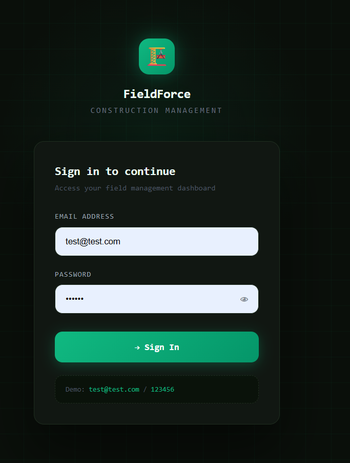
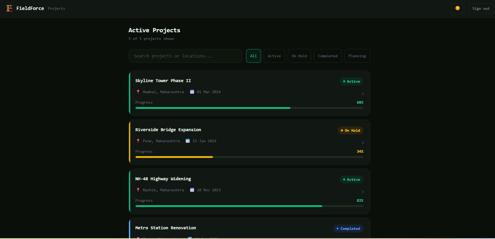
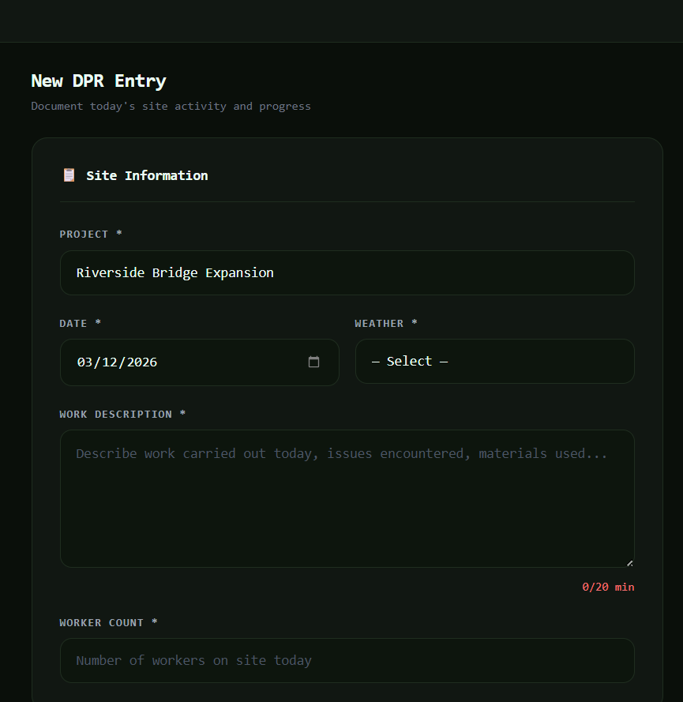

# FieldForce — Construction Field Management App

A responsive React.js web application for managing construction site operations including project tracking, daily progress reporting, and team management.

---

## 📋 Project Overview

This project was built as part of a Frontend Developer internship task to demonstrate:

- React component architecture
- State management using Context API
- Responsive UI design
- Form validation
- Modern frontend development workflow

---

## 📸 Screenshots

| Login | Projects | DPR Form |
|-------|----------|----------|
|  |  |  |

## 🛠️ Tech Stack

- **React.js 18**
- **Tailwind CSS**
- **React Router v6**
- **Vite**
- **Context API** (state management)

---

## ✨ Features

- 🔐 Login with mock authentication
- 📁 Project List with search & status filter
- 📝 Daily Progress Report (DPR) Form
- 📸 Photo upload with preview thumbnails
- 🌙 Dark mode toggle
- 📱 Fully responsive (mobile, tablet, desktop)
- ✅ Input validation with descriptive error messages
- 🔔 Toast notifications on form submission

---

## 🚀 Getting Started

### Prerequisites
- Node.js v18+
- npm

### Installation & Running
```bash
# Clone the repository
git clone https://github.com/Riya2809/construction-dpr-app.git

# Navigate into the project
cd construction-dpr-app

# Install dependencies
npm install

# Start the development server
npm run dev
```

Open your browser at `http://localhost:5173`

---

## 🔑 Login Credentials
```
Email:    test@test.com
Password: 123456
```

---

## 📁 Folder Structure
```
src/
├── components/
│   ├── Navbar.jsx
│   ├── ProjectCard.jsx
│   ├── ImagePreview.jsx
│   └── DarkModeToggle.jsx
├── context/
│   └── AuthContext.jsx
├── data/
│   └── projects.js
├── pages/
│   ├── Login.jsx
│   ├── Projects.jsx
│   └── DPRForm.jsx
└── utils/
    └── validation.js
```

---

## 👩‍💻 Author

**Riya Rajesh Shinde**
Frontend Developer | B.Tech CSE (2026)

GitHub: [https://github.com/Riya2809]
